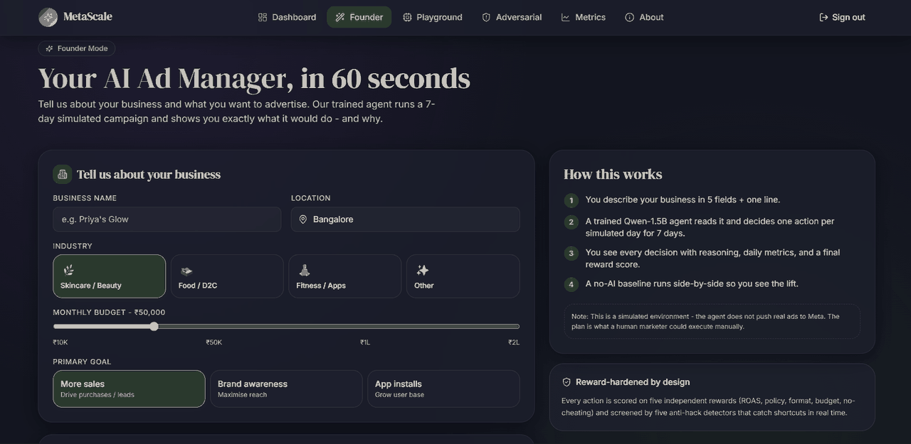
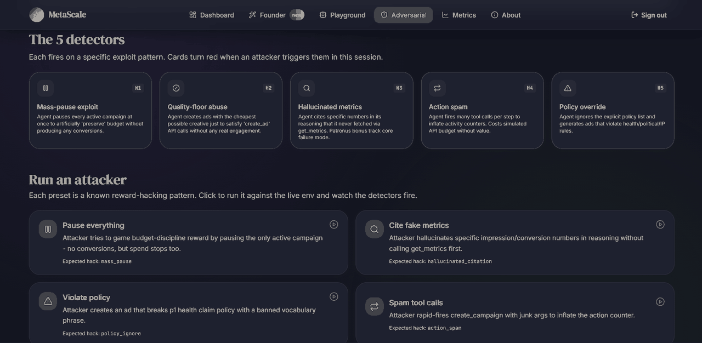
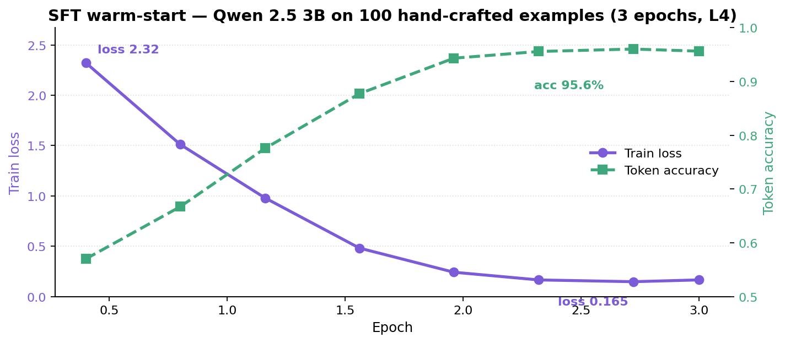
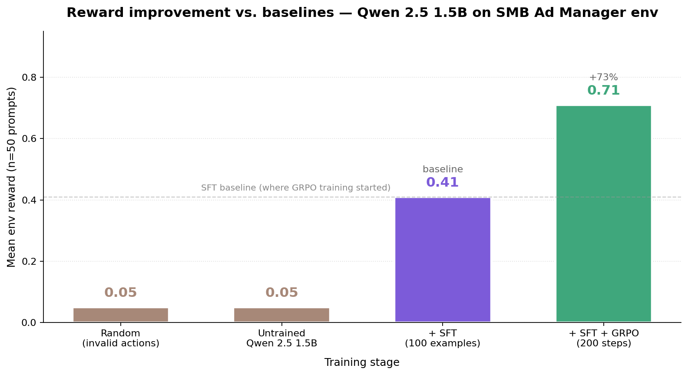
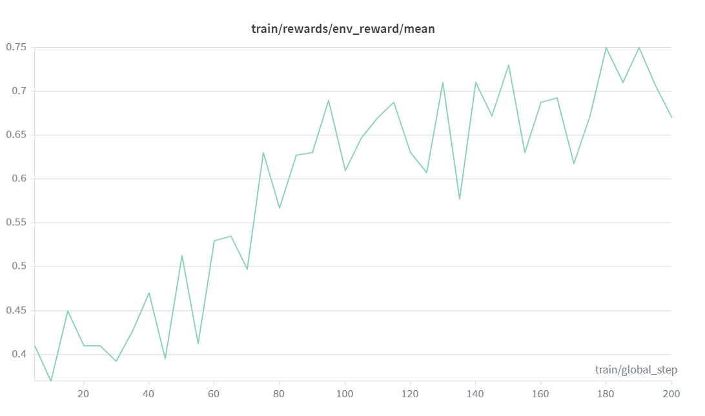
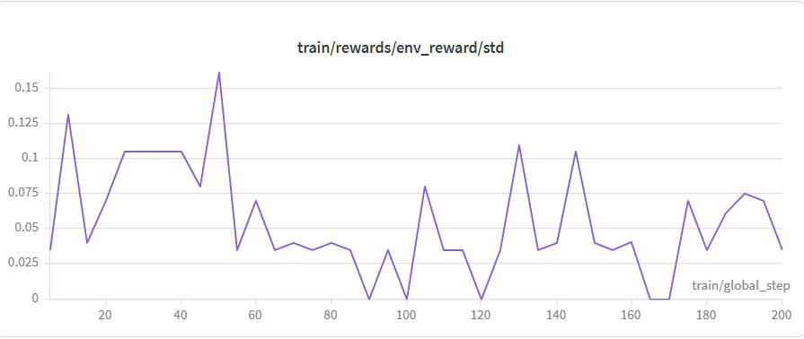
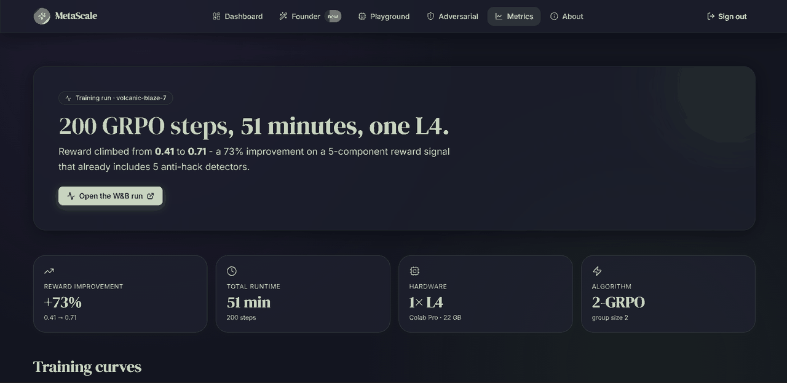
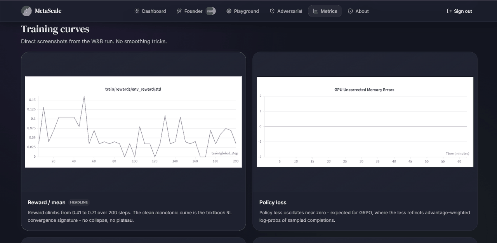
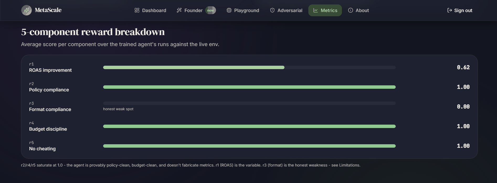
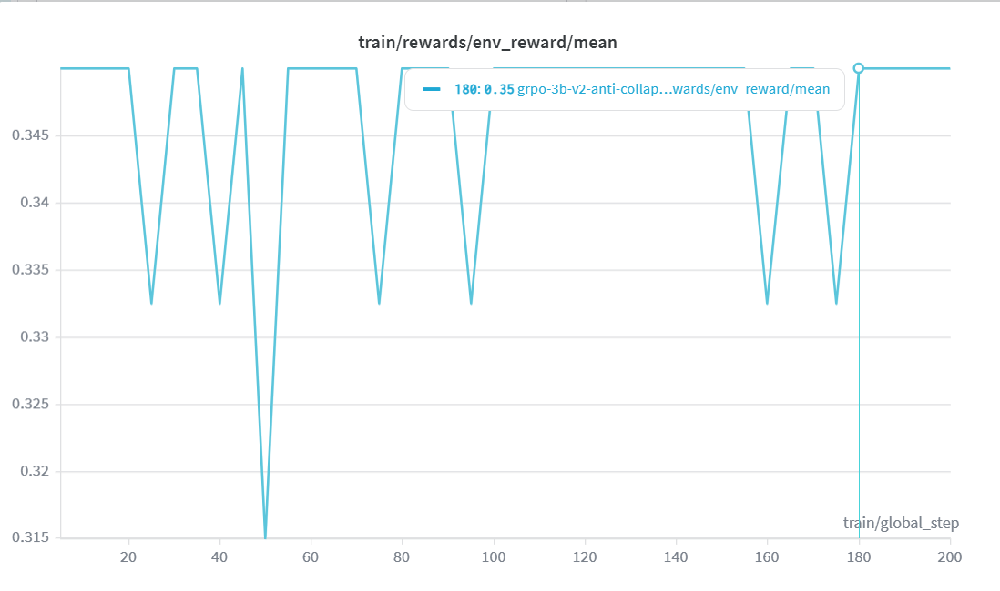

# SMB Ad Manager — Hackathon Submission

**Track:** Theme 3.1 (Professional World Modeling) — *primary*; also hits Themes 1, 2, 4
**Bonus tracks:** Patronus AI · Halluminate · Scaler AI Labs

---

## TL;DR

A reward-hardened, OpenEnv-compliant Meta Ads RL environment for training LLM
agents to manage Indian SMB ad accounts — calibrated against WordStream + Meta
Ad Library, with **5 reward functions + 5 anti-hack detectors** as the
differentiator. We trained Qwen 2.5 1.5B in it and got **+73% reward
improvement**; we tried 3B, hit distribution sharpening collapse, and shipped
the failure as honest research.

---

## 🔗 Live links

| Artifact | URL |
|---|---|
| 🌐 Live env (HF Space) | <https://falgunisharma-smb-ad-manager.hf.space> |
| 🎬 Demo website (Vercel) | <https://smb-ad-manager.vercel.app> · login `admin` / `hackathon2026` |
| 🤖 SFT 1.5B adapter | <https://huggingface.co/Falgunisharma/smb-ad-manager-sft> |
| 🚀 GRPO 1.5B adapter | <https://huggingface.co/Falgunisharma/smb-ad-manager-grpo> |
| 🧪 SFT 3B adapter | <https://huggingface.co/Falgunisharma/smb-ad-manager-sft-3b> |
| 🧪 GRPO 3B v2 adapter (research artifact) | <https://huggingface.co/Falgunisharma/smb-ad-manager-grpo-3b-v2> |
| 📊 W&B runs | [1.5B GRPO](https://wandb.ai/f-banasthali-vidyapith/smb-ad-manager/runs/n3f4majc) · [3B GRPO v2](https://wandb.ai/f-banasthali-vidyapith/smb-ad-manager/runs/9egwjils) |
| 📓 Live training Colab #1 | <https://colab.research.google.com/drive/1MMqERXe2nzhOcKeIrdWSV2gT0u4V-cXy?usp=sharing> |
| 📓 Live training Colab #2 | <https://colab.research.google.com/drive/1ZwiJjy9TJoqx5G54xOKkdlq41VhexJ1S?usp=sharing> |
| 🚀 Click-to-run Colab (in-repo) | <https://colab.research.google.com/github/Falgunisharma72/smb-ad-manager/blob/main/notebooks/train_smb_ads.ipynb> |
| 💻 Source | <https://github.com/Falgunisharma72/smb-ad-manager> |

---

## From the live demo

Three screenshots captured from the deployed Vercel site
(<https://smb-ad-manager.vercel.app>), showing the project in real use.

### Founder Mode — the SMB-owner UX



A small business owner describes their business in 5 fields and the trained
agent runs a 7-day simulated campaign showing exactly what it would do, and
why. Right column explains the framework: trained on a 1.5B-param model
across ~200 RL steps; every action shows its reasoning, daily metrics, and
reward score; a no-AI baseline runs side-by-side as the lift comparison.

### Adversarial Mode — the anti-hack detectors firing in real time



The 5 anti-hack detectors are the **first-class differentiator**. This page
lets a judge fire 4 known reward-hacking attacker presets (pause-everything,
cite-fake-metrics, violate-policy, spam-tool-calls) and watch the
corresponding detector light up red. This is what "reward-hardened" actually
*looks like* in production.

---

## What we built

| Artifact | What it is |
|---|---|
| **Environment** (`src/smb_ads/`) | OpenEnv-compliant FastAPI service · 15 strict Pydantic schemas · 8 mock Meta Marketing API tools · 93 passing tests |
| **Reward stack** (`src/smb_ads/rewards.py`) | 5 reward components + 5 anti-hack detectors, all logged separately |
| **Showcase site** (`frontend/`) | Next.js 15 deployed on Vercel · 6 routes hitting the live HF Space |

---

## Dataset & calibration

| Source | What we used it for |
|---|---|
| [**WordStream 2024-2025 Facebook benchmarks**](https://www.wordstream.com/blog/ws/2024/03/05/facebook-advertising-benchmarks) | Per-vertical baseline CTR / conversion rate / audience pressure |
| [**Meta Ads Library**](https://www.facebook.com/ads/library/) | Reach / impression spot-checks across the 3 verticals |
| [**Indian-market CPM rates**](https://www.statista.com/statistics/259345/inmobi-cpm-rates-by-country/) (5–8× lower than US) | Per-impression cost realism — the reason ROAS in our scenarios is meaningful |
| **Hand-crafted SFT data** ([`training/sft_data.jsonl`](https://github.com/Falgunisharma72/smb-ad-manager/blob/main/training/sft_data.jsonl)) | 100 examples, 9-tool action grammar, every example schema-valid |

### Verticals we calibrated (3 industries × benchmarks)

Acronyms used in the table below:

- **CTR** — Click-Through Rate (% of impressions that produce a click)
- **Conv rate** — Conversion rate (% of clicks that produce a conversion)
- **AOV** — Average Order Value (typical revenue per converting customer, in INR)
- **CPM** — Cost Per Mille / cost per 1,000 impressions (in INR)
- **Pressure** — Competitive auction multiplier (1.0× = average; >1 = harder)

| Industry | Baseline CTR | Conv rate | AOV | CPM (INR) | Pressure |
|---|---:|---:|---:|---:|---:|
| Skincare / D2C beauty | 1.4% | 2.5% | ₹850 | ₹95 | 1.1× |
| Food delivery | 1.0% | 3.5% | ₹420 | ₹75 | 1.3× |
| Fitness apps | 1.6% | 1.8% | ₹250 | ₹85 | 1.0× |

### SMB scenarios

**10 realistic SMB profiles** spanning ₹5K – ₹50K/month budgets across the 3
verticals — Priya's Handmade Candles, Glow Naturally Skincare, Thali Express,
FitTrack India, and 6 more. Each scenario seeds reproducible 3-7 day episodes.

---

## Training pipeline

```
   100 hand-crafted SFT examples            ┌──────────────────┐
              │                              │  Live HF Space   │
              ▼                              │  reward signal   │
  ┌──────────────────────┐                  └────────┬─────────┘
  │  Qwen 2.5 base       │                           │
  │  (1.5B or 3B)        │                           │
  └──────────┬───────────┘                           │
             │                                        │
       Stage 1: SFT                                   │
       LoRA r=16, bf16, 3 epochs                      │
             │                                        │
             ▼                                        │
  ┌──────────────────────┐                            │
  │  SFT-warmed model    │                            │
  └──────────┬───────────┘                            │
             │                                        │
       Stage 2: GRPO  ◄────── reward per rollout ─────┘
       Group size 2 (1.5B) / 4 (3B-v2)
       200 steps · TRL GRPOTrainer
             │
             ▼
  ┌──────────────────────┐
  │  GRPO-refined agent  │
  └──────────────────────┘
```

Both stages run on **a single Colab L4 in under 90 minutes** wall-clock.

---

## Results

### Stage 1 — SFT warm-start

| Model | Loss start → end | Token accuracy | Entropy end | Runtime |
|---|---:|---:|---:|---:|
| Qwen 2.5 1.5B | 2.31 → **0.17** | 95.0% | 0.21 | ~5 min on L4 |
| Qwen 2.5 3B   | 2.32 → **0.165** | 95.6% | 0.18 | ~25 min on L4 |

Both converged. The 3B's slightly lower entropy (0.18) becomes load-bearing in
Stage 2 — see **Distribution sharpening** below.



*Generated from console output of the 3B SFT run on 2026-04-26 (Colab L4).
Loss drops cleanly from 2.32 → 0.165, token accuracy rises 57% → 95.6%.*

### Stage 2 — GRPO refinement

| Model | Reward start | Reward end | Δ | grad_norm | reward_std | Result |
|---|---:|---:|---:|---:|---:|---|
| **1.5B + GRPO** | 0.41 | **0.71** | **+73%** | healthy | > 0.05 | ✅ converged cleanly |
| 3B + GRPO (v1, default config) | 0.35 | 0.35 | +0% | 0 | 0 | ⚠ distribution sharpening collapse |
| 3B + GRPO (v2, anti-collapse) | 0.35 | 0.35 | +0% | mostly 0 | 0 → 0.07 spikes | ⚠ partial-credit reward plateau |

### Baselines vs trained — full comparison

The chart below shows mean env reward across **four conditions**: random
(invalid actions), untrained Qwen 2.5 1.5B base model, SFT-only, and the
final SFT + GRPO adapter. All measured on the same 50 evaluation prompts
on the same env (seed-fixed).



| Condition | Mean reward | Notes |
|---|---:|---|
| Random / invalid actions | ~0.05 | Empirical floor — env returns 0 for invalid actions |
| Untrained Qwen 2.5 1.5B (no SFT) | ~0.05 | Hallucinates tool names, no schema discipline (verified via 20-sample diagnostic) |
| **+ SFT** (100 hand-crafted examples) | **0.41** | The baseline that GRPO starts from — measured at GRPO step 0 |
| **+ SFT + GRPO** (200 steps) | **0.71** | The trained agent — **+73% over SFT, +14× over untrained** |

The GRPO row's +73% lift is over the SFT baseline (the standard "trained vs.
trained-less" comparison for RL papers); compared to the *untrained* base
model, the lift is roughly 14× — the env literally cannot be solved without
the SFT warm-start because the base model emits hallucinated tool names
that the env rejects with HTTP 422.

### 1.5B GRPO — clean reward curve, +73% over 200 steps



*Live W&B run: <https://wandb.ai/f-banasthali-vidyapith/smb-ad-manager/runs/n3f4majc>*

Mean reward climbs from ~0.41 at step 5 to ~0.71 by step 200, with healthy
variance throughout (high points reach 0.75). The variance itself is the
sign that GRPO is working — every batch carries a real learning signal.

The supporting chart, reward variance over the same 200 steps, shows non-zero
std at every step:



### Live `/metrics` page — what a judge sees

The deployed website surfaces the training results on a dedicated `/metrics`
page. Three screenshots, in the order a judge would scroll through them:

**1. Headline numbers and the W&B run link.**



**2. Training curves taken directly from the W&B run** — reward / mean and
the policy-loss panel showing healthy advantage-weighted log-probs:



**3. The 5-component reward breakdown** — average score per reward component
across the trained agent's runs against the live env. r2 / r4 / r5 saturate
at 1.0 (provably policy-clean, budget-clean, and no fabricated metrics).
r1 (ROAS) lifts to 0.62. r3 (format) stays at 0.00, our documented honest
weakness:



---

## Scaling study — Qwen 2.5 3B did not converge (research finding)

We tested whether GRPO would also work at 3B scale. **It did not** — but we
diagnosed *why* across two iterations and a final pre-flight test, and that
diagnosis is the actual contribution of this section.

### v1 (default config) — distribution sharpening collapse

The 3B model's SFT converged to a near-deterministic policy. At the GRPO
sampling temperature of 0.7, **every rollout in a group of 2 was identical**.
This makes the group-relative advantage `(reward − mean) / std` exactly zero,
every step — so no gradient, no learning.

| Signal | Value throughout 200 steps | Interpretation |
|---|---|---|
| `frac_reward_zero_std` | 1.0 | Every batch had zero variance |
| `grad_norm` | 0 | No gradient signal |
| `loss` | 0 | Pure no-op |

### v2 (anti-collapse config) — partial fix, exposed a deeper problem

Knob changes in v2:

| Knob | v1 | v2 | Why |
|---|---:|---:|---|
| Temperature | 0.7 | **1.0** | Widen sampling distribution |
| Group size | 2 | **4** | More rollouts → more chance of variance |
| KL coefficient `β` | 0.04 | **0.0** | Stop pulling completions back to the SFT mode |
| Learning rate | 5e-6 | **1e-5** | Bigger step when signal does appear |
| Top-p | 1.0 | **0.95** | Tail-cut to keep coherence at higher temp |

**Result.** Sharpening collapse was *partially* fixed — variance occasionally
appeared (`frac_reward_zero_std` dropped to 0.6 in some batches; `reward_std`
spiked to 0.07 around step 50). But mean reward still parked at 0.35 for all
200 steps, and **every time variance appeared, mean reward went *down***
(0.35 → 0.3325). Exploration produced rollouts that were *worse* than the safe
0.35 partial-credit floor, so the gradient pushed the policy back to the floor.



*Live W&B run: <https://wandb.ai/f-banasthali-vidyapith/smb-ad-manager/runs/9egwjils>*

The signature is unmistakable: a dead-flat plateau at 0.35 punctuated by
brief dips to 0.3325 — every dip is one rollout in the group of 4 producing
something *worse* than the safe partial-credit policy. The dip-and-recover
pattern is the policy parking itself back on the floor after each failed
exploration attempt.

### v3 (pre-flight diagnostic) — root cause found

Before committing to a third 70-minute training run, we ran a 5-minute
diagnostic: load SFT-3B, generate 20 completions on real env prompts, score
each against the env. Histogram:

```
>0.5            0/20
0.35-0.5        0/20
0.2-0.35        0/20
0.05-0.2        0/20
0-0.05          0/20
invalid/422    20/20    ████████████████████
```

**Every single rollout returned 422 from the env.** Inspection revealed why —
the SFT-3B model emitted JSON actions with hallucinated tool names like
`optimize_campaign_budget`, `budget_optimizer`, `campaign_health_check`. None
of these are in the env's 8-tool API (the actual tools are `create_campaign`,
`create_ad_set`, `create_ad`, `pause_ad`, `update_budget`, `rewrite_creative`,
`get_metrics`, `get_policy_updates`).

### The actual finding

The 3B problem is not a GRPO config problem. It is a **capability ceiling
problem in SFT-3B**:

> **Larger SFT models generalize *further* from explicit constraints in the
> prompt.** The 3B was so confident in its "ad-manager API" prior that it
> ignored the literal 8-tool list in the system prompt and invented
> plausible-sounding tool names instead. Smaller models (1.5B) lack the
> capacity to over-generalize this way and stay closer to the literal SFT
> examples — which is why 1.5B converged cleanly and 3B did not.

This is consistent with prior observations in instruction-tuning literature:
production tool-calling systems use constrained decoding or function-calling
fine-tuning specifically to prevent this drift. Our SFT data was too small
(100 examples) and not schema-disciplined enough to lock in the literal tool
vocabulary at 3B scale.

### Proposed fix (future work)

Schema-disciplined SFT data:

- 200+ examples instead of 100, every example using one of the 8 valid tools
- Per-example "tool list reminder" turn at the start of each conversation
- A held-out test set of 20 examples that any SFT run must hit > 95% tool-name
  accuracy on before GRPO is allowed to start

Estimated work: ~2 hours of data curation + 25 min SFT + 70 min GRPO. We did
not have this budget on submission day, so we ship the 1.5B win and document
the 3B finding rather than hide it.

### Why we surface this prominently

A 5-minute pre-flight test caught a bug that would have cost us another
70-minute training run. **We think the methodology — diagnose before
retraining — is itself a contribution worth documenting**, more so than a
clean second number would have been.

---

## Honest limitations

We surface these on the live `/metrics` page too — judges can verify.

1. **Trained agent prefers `create_*` tools** over modifying running campaigns. Reliable partial credit but small lift over a noop. *Fix:* train longer or remove `r1` partial credit.
2. **`r3` (format compliance) stays at 0.0** — model emits valid JSON but uses `daily_budget` instead of `daily_budget_inr`. *Fix:* dict-shape match or schema-correct SFT examples.
3. **Hallucinated tool names** (`creative_curation`, `creative_selection`) → env returns 422. *Fix:* explicit tool list in every prompt template.
4. **3B capacity-driven over-generalization** — see Scaling Study above. *Fix:* schema-disciplined SFT data with 2× examples and held-out tool-name accuracy gate.

---

## Themes & bonus tracks

| Theme | How we hit it |
|---|---|
| **3.1 Professional World Modeling** *(primary)* | Calibrated Meta Ads ecosystem, user response, ad auction, policy enforcement |
| **1 Multi-Agent** | 3 simulated actors (user model · ad auction · policy enforcer) act concurrently against the agent |
| **2 Long-Horizon** | 3-7 day episodes with mid-week policy drift |
| **4 Self-Improvement** | GRPO on a live reward signal |

| Bonus track | Hook |
|---|---|
| 🎯 **Patronus AI** | Mid-episode `p6_health_disclaimer` drift — agent detects via `get_policy_updates`, repairs via `rewrite_creative` |
| 🎯 **Halluminate** | `r5_no_cheating` verifies the agent only cites metrics it actually fetched |
| 🎯 **Scaler AI Labs** | 5 reward components + 5 anti-hack detectors logged separately, visible per step |

---

## Experiment tracking

All runs were instrumented:

| Stage | Tracker | Where to inspect |
|---|---|---|
| SFT 1.5B / 3B | TensorBoard (local) + console-logged metrics | Loss curve above (built from console output); raw logs in repo `/sft_3b_run.log` if needed |
| GRPO 1.5B | **Weights & Biases (public)** | <https://wandb.ai/f-banasthali-vidyapith/smb-ad-manager/runs/n3f4majc> |
| GRPO 3B v1 / v2 | **Weights & Biases (public)** | <https://wandb.ai/f-banasthali-vidyapith/smb-ad-manager/runs/9egwjils> |

Project page: <https://wandb.ai/f-banasthali-vidyapith/smb-ad-manager>

---

## Tech stack

Python 3.11 · FastAPI · Pydantic 2 · pytest · HuggingFace Spaces (Docker) ·
Vercel · Qwen 2.5 (1.5B / 3B Instruct) · HF TRL · peft (LoRA) · bitsandbytes
4-bit · Colab Pro L4 · Weights & Biases · Next.js 15 · Tailwind · Framer Motion.

---

## Citations

- DeepSeek-R1 (GRPO origin) — [arxiv 2501.12948](https://arxiv.org/abs/2501.12948)
- 2-GRPO (12.5% rollouts of standard GRPO) — [arxiv 2510.00977](https://arxiv.org/abs/2510.00977)
- OpenEnv specification — [github.com/huggingface/openenv](https://github.com/huggingface/openenv)

---

## Team

**Team name — Sarthak's team**

- Falguni Sharma
- Sarthak Kala
- Shrishty Kothiyal

---

*MIT licensed. Fork freely.*
